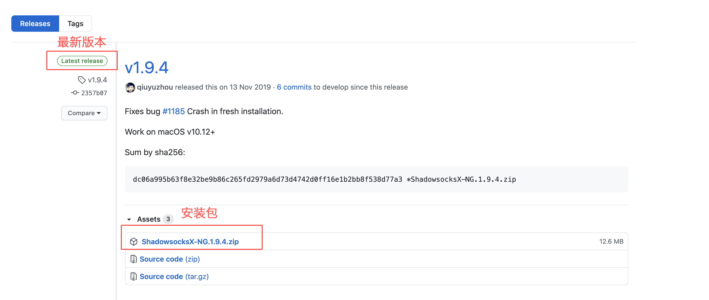
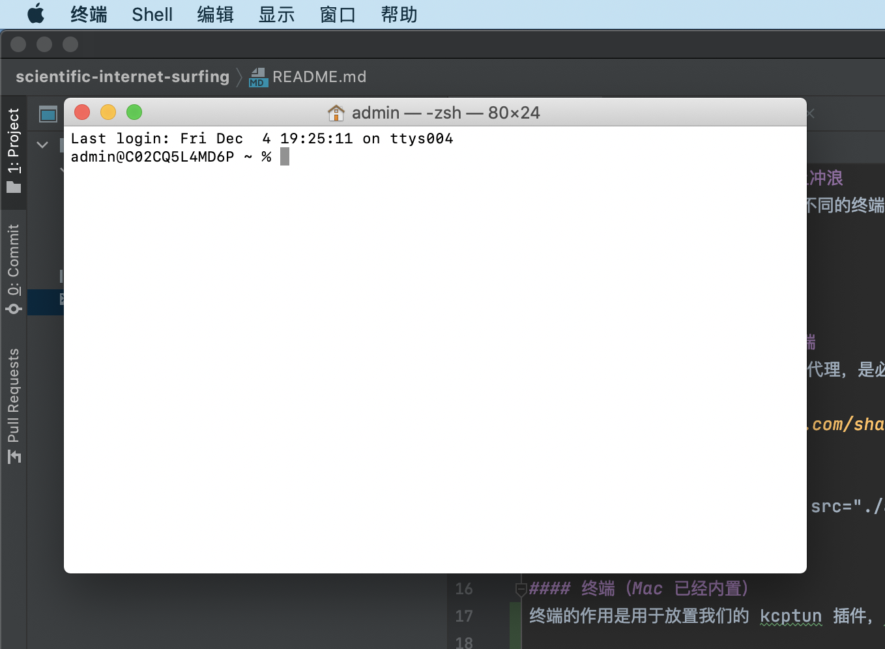

# 字节代购 - 使用 SS 客户端网上冲浪
在已经有服务端代理的情况下，使用不同的终端，进行科学网上冲浪

## iPhone/iPad 篇
### 知识补齐 - 我们需要什么
### 安装使用步骤

## 安卓篇
### 知识补齐 - 我们需要什么
### 安装使用步骤

## Mac 篇
### 知识补齐 - 我们需要什么
#### shadowsocks Mac 版客户端
shadowsocks 客户端的作用是连接代理，是必要的，shadowsocks 本质是一种代理服务（就类似网络代购），它的客户端在不同的设备上有各种实现形式，我们这里需要它的 Mac 版

去这里 [下载](https://github.com/shadowsocks/ShadowsocksX-NG/releases/) 最新的 Mac 客户端，选择 Latest release 里的 Assets 中的 ShadowsocksX-NG.x.y.z.zip 下载即可，注意 x.y.z 是版本号，诸如1.9.4，会随着官方更新产生变化升级

  

#### 终端（Mac 已经内置）
终端的作用是用于放置我们的 kcptun 插件，kcptun 可以简单的理解为可以用于加速网络的一种通信方式，kcptun 是必要的，因为对于网络提速它效果显著

Mac 中打开终端的方式很简单，在启动台搜索终端即可

  

如果你打开它，它是这个样子的

  

不用担心它们的使用方法，在下文的安装过程中，我会介绍具体如何使用以上的东西

### 安装使用步骤

## Windows 篇
### 知识补齐 - 我们需要什么
### 安装使用步骤